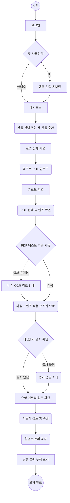
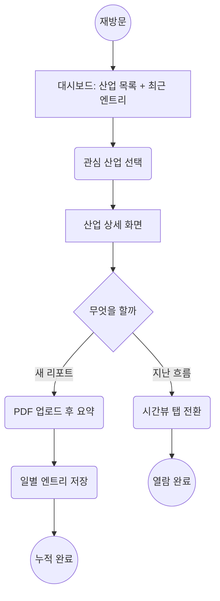
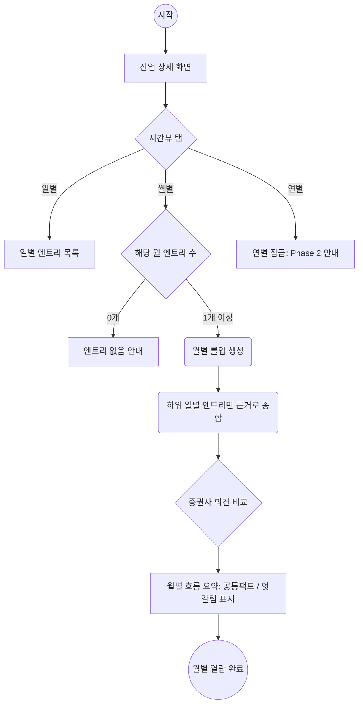
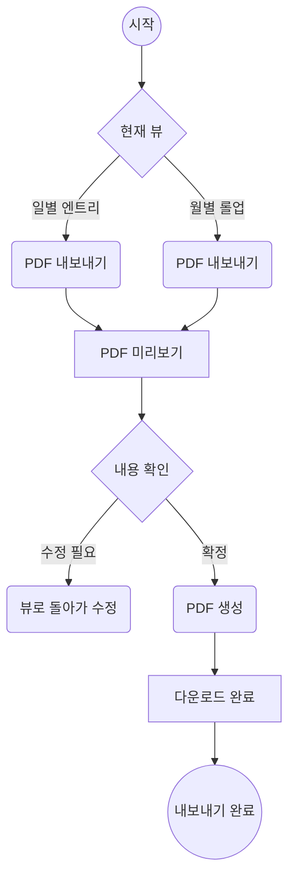

# 유저플로우 — 리포트렌즈 (ReportLens) v0.1

> 작성: 2026.06.22 | 기획: 장인우
> 입력: `PRD_렌즈_v0.1.md` | 범위: MVP(렌즈 2개 · 일별/월별 · 증권사 수동 업로드)
> 페르소나: 매일 리포트를 보는 PM/취업 준비자 + 주식 참고자 (본인 포함 5~10명)

---

## 1. 플로우 범위

- 시작 상태: 사용자가 오늘 받은 리포트 PDF를 손에 들고 있음
- 목표 상태: 내 목적(렌즈)에 맞게 요약된 일별 엔트리가 산업별로 누적되고, 월별 흐름을 보고 PDF로 내보냄
- 핵심 원칙: **입력은 본인 업로드만**(BYO) · **핵심숫자는 출처 인용** · **롤업은 하위 엔트리만 근거**

---

## 2. 메인 유저플로우 A — 최초 사용 (온보딩 → 첫 요약)

---

## 3. 메인 유저플로우 B — 재방문 누적 사용

---

## 4. 유저플로우 C — 시간뷰 전환 / 월별 롤업

---

## 5. 유저플로우 D — PDF 내보내기

---

## 6. 화면 목록

| # | 화면명 | 경로 | 설명 | 진입 조건 |
|---|--------|------|------|----------|
| 1 | 로그인 | `/login` | 사용자별 비공개 보장용 간단 인증 | 비로그인 |
| 2 | 렌즈 선택 온보딩 | `/onboarding` | PM·취업 / 주식투자 렌즈 선택(변경 가능) | 첫 사용 |
| 3 | 대시보드 | `/` | 산업 목록 + 최근 엔트리 + 새 산업 추가 | 로그인 |
| 4 | 산업 상세 | `/industry/:id` | 일/월/연 탭 + 업로드 버튼 | 산업 선택 |
| 5 | 업로드 화면 | `/industry/:id/upload` | PDF 선택 + 렌즈 확인 | 업로드 클릭 |
| 6 | 요약 엔트리 검토 | `/industry/:id/entry/:eid` | 추출 요약 검토·수정·저장 | 요약 완료 |
| 7 | 월별 롤업 | `/industry/:id/month/:ym` | 그 달 흐름 종합 화면 | 월별 탭 |
| 8 | PDF 미리보기 | (모달) | 내보내기 전 확인 | 내보내기 클릭 |

---

## 7. 의사결정 매트릭스

| 분기 조건 | 결과 A | 결과 B | 처리 방식 |
|-----------|--------|--------|-----------|
| 첫 사용 여부 | 렌즈 온보딩 | 대시보드 직행 | 온보딩 1회만 |
| PDF 텍스트 추출 | 바로 파싱 | 스캔본 → 비전 OCR 경로 | kordoc/markpdfdown 분기 |
| 핵심숫자 출처 | 인용 표기 | "명시 없음" 비움 | 가드레일: 생성 금지 |
| 월 엔트리 수 | 롤업 생성 | 엔트리 없음 안내 | 0개면 롤업 비활성 |
| 연별 탭 | (MVP 잠금) | Phase 2 안내 | 데이터 누적 후 오픈 |
| 외부 URL 입력 시도 | 차단 | BYO 업로드 유도 | 자동수집 금지 가드 |

---

## 8. 에러 / 예외 처리

| 케이스 | 발생 지점 | 처리 |
|--------|-----------|------|
| 지원 안 되는 파일/용량 초과 | 업로드 | 형식·용량 안내 후 재시도 |
| PDF 텍스트 추출 실패(스캔) | 파싱 | 비전 OCR 경로로 전환 안내, 실패 시 수동 입력 |
| LLM 요약 오류/타임아웃 | 요약 | 재시도 버튼 + 부분 결과 보존 |
| 요약 품질 불만 | 검토 화면 | 사용자가 직접 수정·저장(human-in-the-loop) |
| 롤업 근거 부족 | 월별 | "엔트리 N개로는 흐름 약함" 경고 표시 |
| 저작권 민감 행위(자동수집·공유) | 전역 | 기능 미제공 + 안내(개인 비공개 원칙) |

---

## 9. 품질 체크리스트

- [x] 각 화면의 사용자 행동 표현됨
- [x] 에러 복구 경로 있음(재시도·수동입력·비전경로)
- [x] 취소/뒤로 = 검토 화면에서 저장 전 이탈 시 임시보존
- [x] 로그인/첫사용 분기 명확
- [x] 모든 플로우 시작·종료 명확
- [x] 가드레일(출처·롤업근거·BYO)이 플로우에 반영됨

---

## 다음 단계
1. **와이어프레임** — 화면 1~8 레이아웃 설계
2. 기능명세 — 분기별 기술 명세(파싱·요약·롤업 API)
